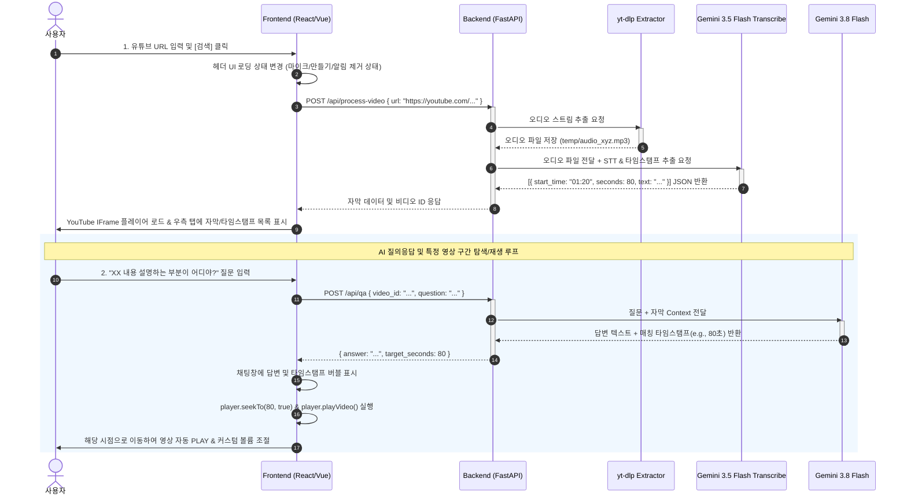

# AI 유튜브 검색기 (AI YouTube Searcher) 웹서비스 기획안

**문서 버전:** v1.1  
**작성일자:** 2026년 9월 10일  
**기획 대상:** 신규 서브 폴더 개발 프로젝트 (`/ai-youtube-searcher`)

---

## 📌 1. 프로젝트 개요 및 목표

* **프로젝트명:** AI 유튜브 검색기 (AI YouTube Searcher)
* **목적:** 긴 유튜브 영상을 처음부터 끝까지 시청하지 않고도 핵심 내용을 빠르게 탐색하고, AI 질의응답을 통해 원하는 타임라인으로 바로 이동하여 영상 위치를 재생할 수 있는 웹기반 서비스 구축
* **주요 특징:**
  * 상단 검색창에 YouTube 링크 입력 시 커스텀 플레이어로 영상 로딩 및 음향 조절 기능
  * 상단 우측 불필요 UI (**마이크, 만들기(+), 알림 버튼**) 완전 제거로 깔끔하고 집중도 높은 UI
  * YouTube 영상에서 오디오 다운로드 후 `Gemini 3.5 Flash Transcribe` 모델을 활용하여 타임스탬프 및 transcript 추출
  * 추출된 자막 기반으로 `Gemini 3.8 Flash` 모델을 활용한 Q&A 기능 구축
  * 질문 답변 시 특정 키워드/내용 위치(타임스탬프 초)로 이동하여 영상 자동 PLAY 기능 제공

---

## 🎨 2. UI/UX 및 레이아웃 기획

| 영역 | 구성 요소 | 기능 및 UI 디자인 규칙 |
| :--- | :--- | :--- |
| **1. 상단 헤더**<br>*(Top Header)* | • 서비스 로고 (`AI YouTube Searcher`)<br>• 유튜브 URL 입력창 (`Input`)<br>• 검색/분석 버튼 (`Search Button`) | • YouTube URL 입력 후 Enter 또는 클릭 시 오디오 추출 및 AI 분석 시작<br>• ❌ **제외:** 마이크, 만들기(+), 알림 아이콘 완전 제거<br>• 우측 상단은 최소한의 메뉴/상태 표시 영역만 유지 |
| **2. 메인 좌측**<br>*(Main Left)* | • YouTube 비디오 플레이어<br>• 음향(Volume) 조절 슬라이더<br>• 영상 기본 정보 (제목, 채널명) | • YouTube IFrame API 기반 동영상 출력<br>• 슬라이더를 통한 커스텀 음향 크기(`Volume`) 조절 기능<br>• AI Q&A 검색 클릭 시 정밀 시점 이동(`seekTo`) 및 자동 재생(`playVideo`) |
| **3. 메인 우측**<br>*(Main Right)* | • 탭 메뉴 (자막/타임스탬프, AI Q&A)<br>• 타임스탬프 트랜스크립트 리스트<br>• AI 채팅 인터페이스 | • **[자막 탭]:** 시간대별 자막 리스트 출력, 타임스탬프 클릭 시 해당 시점 이동<br>• **[AI Q&A 탭]:** `Gemini 3.8 Flash` 기반 실시간 질의응답 및 타임라인 이동 링크 제공 |

---

## 🏗️ 3. 시스템 아키텍처 및 데이터 흐름 다이어그램

### 3.1 전체 시스템 아키텍처 (System Architecture Diagram)

```mermaid
graph TD
    subgraph Client ["Client Side (Browser)"]
        UI["React/Vue Frontend"]
        YT_Player["YouTube IFrame Player\n(Video & Volume Control)"]
        Chat_UI["AI Q&A Chat UI &\nTranscript Panel"]
    end

    subgraph Server ["Server Side (Backend - FastAPI)"]
        API_Gateway["FastAPI Server Engine"]
        Extractor["Audio Extractor (yt-dlp)"]
        Cache_DB[("Cache / Session Store")]
    end

    subgraph AI_Services ["Google Gemini AI Services"]
        Gemini_STT["Gemini 3.5 Flash Transcribe\n(Audio -> Timestamp & Transcript JSON)"]
        Gemini_QA["Gemini 3.8 Flash\n(Transcript Context Q&A & Seek Timestamp)"]
    end

    %% Client - Server Connection
    UI -->|1. Submit YouTube URL| API_Gateway
    API_Gateway -->|2. Trigger Download| Extractor
    Extractor -->|3. Audio Stream (.mp3/.wav)| API_Gateway

    %% Server - AI Connection
    API_Gateway -->|4. Send Audio File| Gemini_STT
    Gemini_STT -->|5. Return Transcript JSON| API_Gateway
    API_Gateway -->|6. Cache Transcript Data| Cache_DB
    API_Gateway -->|7. Send Transcript & Video ID| UI

    %% Q&A Loop
    Chat_UI -->|8. User Question| API_Gateway
    API_Gateway -->|9. Question + Transcript Context| Gemini_QA
    Gemini_QA -->|10. Answer + Target Timestamp (seconds)| API_Gateway
    API_Gateway -->|11. Send Response| Chat_UI

    %% Player Control Loop
    Chat_UI -->|12. Seek Event (Timestamp Click or Answer Select)| YT_Player
```

---

### 3.2 상세 데이터 흐름도 (Data Flow Sequence Diagram)



---

## 🤖 4. AI 모델 및 기술 스택 상세 명세

| 구분 | 사용 기술 / 모델 | 역할 및 세부 설정 |
| :--- | :--- | :--- |
| **STT / Transcribe** | `Gemini 3.5 Flash Transcribe` | 오디오 파일 입력 받아 타임스탬프(`hh:mm:ss`)와 해당 구간 자막 추출<br>JSON 구조화 응답 (`[{start_time: "01:23", seconds: 83, text: "..."}]`) |
| **LLM / Q&A Engine** | `Gemini 3.8 Flash` | 자막 전문을 Context/System Instruction으로 수신<br>질문 답변 및 연관 타임스탬프 초(`seconds`) 정보 함께 반환 |
| **Backend Framework** | Python (FastAPI / Flask) | YouTube 오디오 추출 (`yt-dlp` 라이브러리 사용)<br>Gemini API 연동 및 비동기 파이프라인 처리 |
| **Frontend Framework** | React / Next.js 또는 Vue.js | 신규 서브 폴더 구조 내 SPA 구축<br>YouTube IFrame Player API 연동 (`seekTo`, `setVolume`, `playVideo`) |

---

## 💻 5. 핵심 코드 구조 설계 예시

### 5.1 오디오 추출 및 Gemini 3.5 Flash Transcribe 프롬프트
```python
# 백엔드: Gemini 3.5 Flash Transcribe 프롬프트 예시
SYSTEM_PROMPT_TRANSCRIBE = \"\"\"
당신은 음성 타임스탬프 전문 추출기입니다. 
제공된 오디오 파일의 발화를 분석하여 다음 JSON 형식으로 응답하세요.

[
  {
    "start_time": "00:05",
    "seconds": 5,
    "text": "안녕하세요, 오늘 소개할 주제는..."
  }
]
\"\"\"
```

### 5.2 프론트엔드 YouTube Player 및 볼륨/시점이동 조절
```javascript
// 프론트엔드: YouTube Iframe API 조절 함수
function jumpToAndPlay(seconds) {
    if (player && typeof player.seekTo === 'function') {
        player.seekTo(seconds, true); // 특정 타임스탬프 위치로 이동
        player.playVideo();           // 영상 자동 PLAY
    }
}

function setVolume(volumeLevel) {
    if (player && typeof player.setVolume === 'function') {
        player.setVolume(volumeLevel); // 0 ~ 100 음향 크기 조절
    }
}
```

---

## 📁 6. 서브 폴더 디렉토리 구조 (Directory Structure)

기존 프로젝트 하위에 신규 서브 폴더(`ai-youtube-searcher/`)를 구성하는 추천 스키마입니다.

```text
project-root/
│
└── ai-youtube-searcher/             # 📂 신규 서브 폴더
    ├── backend/                     # 🐍 백엔드 (Python)
    │   ├── main.py                  # API 엔드포인트 (FastAPI)
    │   ├── services/
    │   │   ├── audio_extractor.py   # yt-dlp 오디오 다운로드
    │   │   ├── gemini_stt.py        # Gemini 3.5 Flash Transcribe 연동
    │   │   └── gemini_qa.py         # Gemini 3.8 Flash Q&A 연동
    │   └── requirements.txt
    │
    ├── frontend/                    # ⚛️ 프론트엔드 (React / Vue)
    │   ├── src/
    │   │   ├── components/
    │   │   │   ├── Header.jsx       # 상단 검색창 (마이크/만들기/알림 제거)
    │   │   │   ├── VideoPlayer.jsx  # YouTube Player & 음향 조절 컨트롤러
    │   │   │   ├── Transcript.jsx   # 타임스탬프 자막 목록
    │   │   │   └── ChatQA.jsx       # Gemini 3.8 Flash Q&A 채팅
    │   │   └── App.jsx
    │   └── package.json
    └── README.md
```

---

## 🚀 7. 향후 로드맵

1. **MVP 구현 (1단계):** URL 입력 → 오디오 추출 → `Gemini 3.5 Flash Transcribe` 자막 추출 → `Gemini 3.8 Flash` Q&A & 타임스탬프 이동 PLAY 완성
2. **성능 최적화 (2단계):** 동일 URL 재검색 시 오디오 재다운로드 없이 자막 캐싱(Redis/DB) 응답 구조 추가
3. **기능 확장 (3단계):** 영상 전체 3줄 요약 카드 및 주요 키워드 태그 클라우드 제공
